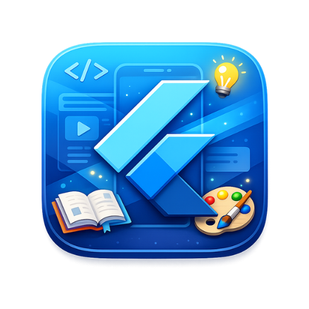
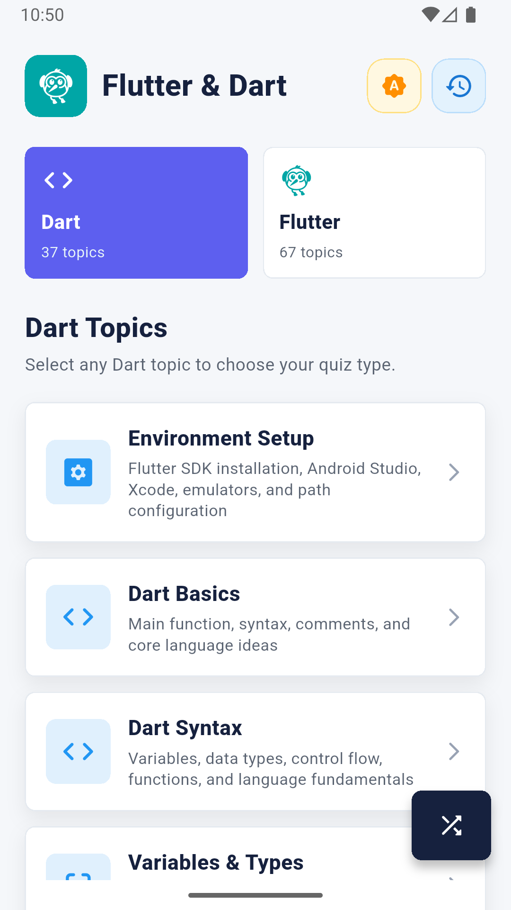
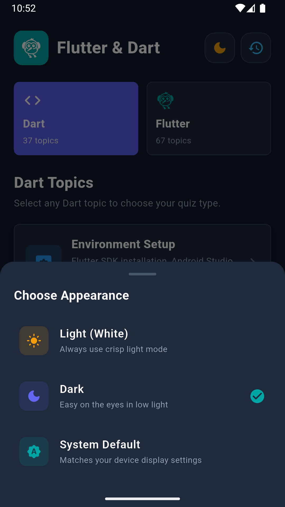
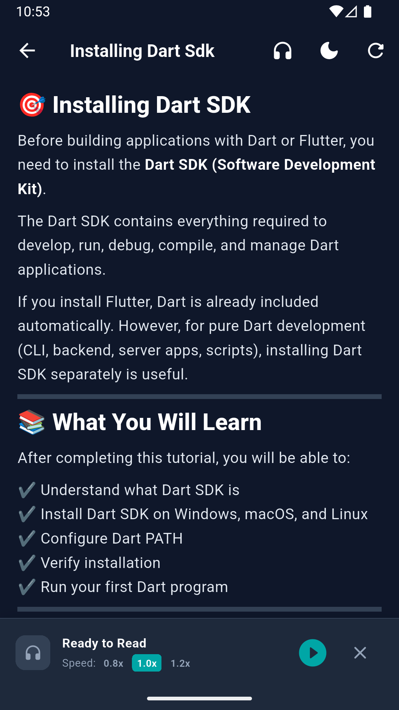
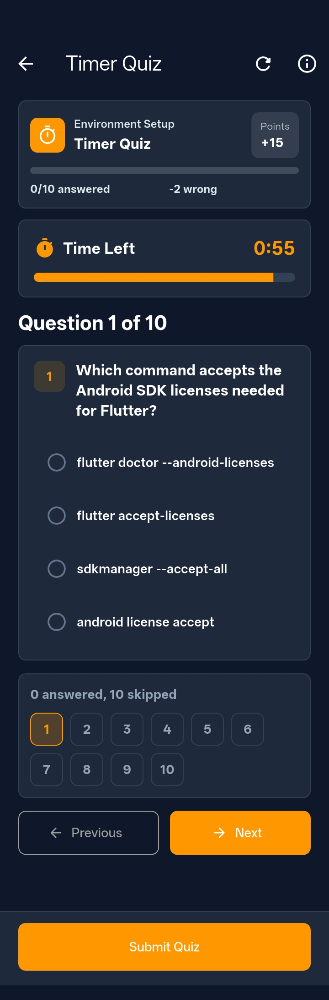
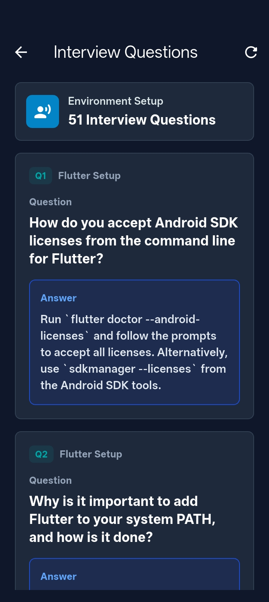
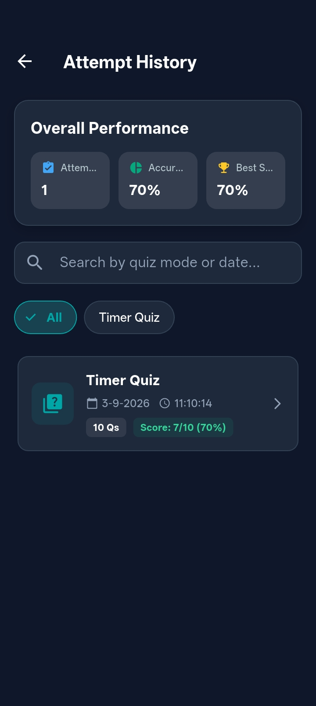

# 📱 Flutter Tut — Flutter MCQ & Technical Interview Prep

  

  <strong>An interactive, Flutter & Dart mastery platform featuring smart MCQ exams, technical interview banks, code challenges, text-to-speech audio lessons, and dynamic light/dark theming.</strong>

---

## ⚡ One-Line Tagline

> **Your all-in-one pocket companion to learn, listen, practice, test, and master Flutter & Dart from fundamentals to senior technical interviews.**

---

## 📸 Screenshots & Demo Preview

| 📱 Home & Topics | 🌙 Dark Theme Switcher | 📖 Lesson & TTS Player |
|:---:|:---:|:---:|
|  |  |  |

| ⏱️ Timed Quiz Runner | 💼 Interview Q&A Bank | 📊 Attempt History |
|:---:|:---:|:---:|
|  |  |  |

---

## 💡 What is this App?

**Flutter Tut** is a complete, modern mobile learning ecosystem purpose-built for Flutter engineers, Dart enthusiasts, and software candidates preparing for job interviews.

Instead of passively reading tutorials or clicking through dry documentation, **Flutter Tut** integrates:
1. **Interactive MCQs** with live scores, penalties, and comprehensive explanations.
2. **Technical Interview Questions** with in-depth explanations covering design patterns, state management, and engine internals.
3. **Structured Syllabus Reader** rendering detailed Markdown lessons for every Flutter and Dart topic.
4. **Text-To-Speech (TTS) Voice Reader** that cleans markdown and reads lessons aloud with selectable playback speeds (0.8x, 1.0x, 1.2x).
5. **Hands-On Code Completion** drills allowing users to edit and complete real code snippets.
6. **Adaptive Theming** with pure white light mode, rich OLED-friendly dark mode, and system synchronization.

---

## 🚀 Why this App? / Key Benefits

| Traditional Learning | 🚀 With Flutter Tut |
|---|---|
| 😴 Passive reading with low knowledge retention | 🧠 **Active Recall**: Timed tests, penalties, and instant explanations reinforce neural memory. |
| 🖥️ Hard to study while commuting or busy | 🎧 **Hands-Free Audio**: Listen to markdown lessons aloud using the built-in TTS voice reader. |
| 📑 Scattered interview questions across blogs | 💼 **Curated Interview Bank**: Senior-level architectural and conceptual questions in one place. |
| 👁️ Eye fatigue in low-light environments | 🌙 **Theme Versatility**: High-contrast, meticulously designed Dark, Light, and System themes. |
| 🔔 Forgetting to revise regularly | ⏰ **Daily Habit Engine**: Automated scheduled push reminders keep your learning streak alive. |

---

## 🎯 Main Features

### 1. 🎮 Diverse Quiz & Examination Modes
- **Regular Mode**: Relaxed, untimed quiz designed for stress-free conceptual learning.
- **Timer Quiz**: 60-second challenge with negative marking to simulate real exam pressure.
- **Rapid Fire**: 30-second reflex drill with auto-advancing questions.
- **Daily Challenge**: 10 mandatory questions updated daily to build lasting consistency.
- **Practice Exam**: Code completion and fill-in-the-blank programming challenges.

### 2. 🎧 Text-To-Speech (TTS) Audio Lesson Player
- Integrated directly into the full-screen markdown reader.
- Custom regex speech sanitization engine strips markdown hashes, asterisks, backticks, and raw URL syntax for natural human narration.
- Play, pause, resume, and variable speech rate switching (`0.8x`, `1.0x`, `1.2x`).
- Background safe playback with clean state lifecycle cleanup on dispose.

### 3. 🌓 Dynamic Tri-Theme System
- **Light Theme**: Crisp, clean white surfaces with navy ink typography and teal accents.
- **Dark Theme**: Deep slate/OLED dark backgrounds (`#0F172A`), rich surface cards (`#1E293B`), and high-contrast text.
- **System Theme**: Automatically mirrors your device's global display preferences.
- Instant modal switcher accessible from the AppBar or lesson headers with persistent storage via `SharedPreferences`.

### 4. 💼 Technical Interview Question Bank
- Comprehensive categorized question catalog covering:
  - **Flutter Core**: Widgets, BuildContext, InheritedWidget, Keys, Element Tree, RenderObjects.
  - **State Management**: Bloc, Provider, Riverpod, ValueNotifier, setState trade-offs.
  - **Dart Runtime**: Event loop, Microtasks, Streams, Isolates, Memory allocation, GC.
  - **Performance & Lifecycle**: Const constructors, RepaintBoundary, DevTools profiling.
